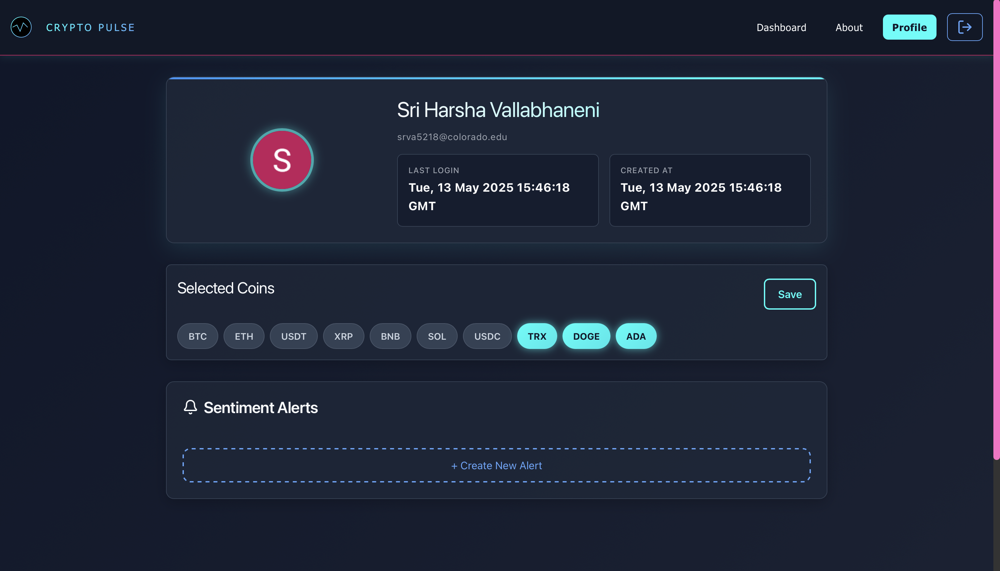

# CryptoPulse

> Your Crypto-Invest Mate 🚀  
> Real-time sentiment aggregation from Reddit, news, and more — all in one place.

---

## 📖 Table of Contents

- [Problem & Solution](#problem--solution)
- [Key Features](#key-features)
- [Architecture & Tech Stack](#architecture--tech-stack)
- [Getting Started](#getting-started)
  - [Prerequisites](#prerequisites)
  - [Installation](#installation)
  - [Running Locally](#running-locally)
- [API Reference](#api-reference)
- [Demo](#demo)
- [Future Work & Roadmap](#future-work--roadmap)
- [Credits](#credits)

---

## 🚩 Problem & Solution

**Problem:** Crypto markets are notoriously volatile and move faster than any single news source can keep up. Real-time public sentiment lives scattered across Reddit, Twitter, news feeds, Telegram, and Discord — making it hard for retail investors to harness.

**Solution:** CryptoPulse unifies multiple sentiment streams into a single, easy-to-understand score per coin and per topic. We fetch posts & articles, run them through AI models (VADER & BERT), aggregate via a Go microservice, and visualize insights in a sleek React dashboard.

---

## ✨ Key Features

- **Multi-source Stream Handler**  
  - Reddit (primary), News (batch import), Twitter (optional)  
  - Configurable time-window & per-coin filtering  

- **AI-driven Sentiment Models**  
  - Lightweight VADER for speed  
  - BERT fine-tuned for crypto slang  

- **Custom Aggregator Microservice (Go)**  
  - Combines individual scores into a unified sentiment index  
  - Handles spikes, noise-filtering & time-binning  

- **Secure Auth & Data Storage**  
  - Firebase Auth + Firestore for user management  
  - PostgreSQL (Neon) for historical messages  

- **DevOps & Deployment**  
  - Dockerized services  
  - CI/CD via GitHub Actions  
  - Hosted on Google Cloud Run  

---

## 🏗 Architecture & Tech Stack

<p align="center">
  
</p>

| Layer               | Technology                           |
|---------------------|--------------------------------------|
| **Stream Handler**  | Python · Flask · PRAW (Reddit)       |
| **Sentiment Model** | Python · VADER · Transformers (BERT) |
| **Aggregator**      | Go                                   |
| **Auth**            | Firebase Authentication & Firestore  |
| **Dashboard**       | React.js · Recharts                  |
| **Database**        | PostgreSQL (Neon)                    |
| **Containerization**| Docker                               |
| **CI/CD**           | GitHub Actions · Google Cloud Run    |
| **Version Control** | Git · GitHub                         |
| **Issue Tracking**  | Jira                                 |

---

## 🚀 Getting Started

### Prerequisites

- Git  
- Docker & Docker Compose  
- Node.js & npm (for frontend)  
- Python 3.9+  
- Go 1.18+  

### Installation

1. **Clone the repo**  
   ```bash
   git clone https://github.com/vsriharsha814/crypto-sentiment-stream.git
   cd crypto-sentiment-stream
   ```

2. **Backend**
   ```bash
   cd stream-handler
   cp .env.example .env
   # Fill in your REDDIT_CLIENT_ID, REDDIT_CLIENT_SECRET, DB_*, FIREBASE_* vars
   python3 -m venv venv && source venv/bin/activate
   pip install -r requirements.txt
   ```

3. **Frontend**
   ```bash
   cd ../frontend/my-crypto-app
   npm install
   ```

4. **Go Aggregator**
   ```bash
   cd ../../go-service
   go build -o aggregator .
   ```

### Running Locally

```bash
# 1. Ensure your Neon/Postgres DB is reachable.
# 2. In separate terminals:

# Backend API
cd stream-handler
source venv/bin/activate
python app.py

# Go Aggregator
cd ../go-service
./aggregator

# Frontend Dashboard
cd ../frontend/my-crypto-app
npm start
```

---

## 📡 API Reference

Base URL: `http://localhost:5000` (local) or `https://your-domain.com` (production)

### Reddit Data Endpoints

#### `POST /reddit_posts`
Fetch posts for selected coins and questions from Reddit.

**Request Body:**
```json
{
  "coins": ["BTC", "ETH", "DOGE"],
  "questions": ["bullish", "bearish"],
  "timeframe": "day"
}
```

**Response:**
```json
{
  "status": "success",
  "posts_fetched": 42,
  "data": [
    {
      "id": "abc123",
      "coin": "BTC",
      "content": "...",
      "sentiment_score": 0.75,
      "timestamp": "2025-05-13T10:00:00Z"
    }
  ]
}
```

#### `POST /reddit_db_dump`
Dump fetched posts into the database for historical tracking.

**Request Body:**
```json
{
  "posts": [
    {
      "id": "abc123",
      "coin": "BTC",
      "content": "...",
      "sentiment_score": 0.75
    }
  ]
}
```

**Response:**
```json
{
  "status": "success",
  "posts_inserted": 1,
  "message": "Posts successfully inserted into database"
}
```

#### `GET /reddit_status`
Verify Reddit API authentication and connection status.

**Response:**
```json
{
  "status": "connected",
  "authenticated": true,
  "rate_limit_remaining": 580,
  "reddit_username": "CryptoPulseBot"
}
```

### Testing Endpoints

#### `POST /test_insert`
Insert a sample record into the database for testing purposes.

**Request Body:**
```json
{
  "test_data": {
    "coin": "TEST",
    "message": "This is a test record",
    "sentiment": 0.5
  }
}
```

**Response:**
```json
{
  "status": "success",
  "test_record_id": "12345",
  "message": "Test record successfully inserted"
}
```

### Error Responses

All endpoints may return the following error formats:

```json
{
  "status": "error",
  "error_code": "RATE_LIMIT_EXCEEDED",
  "message": "Reddit API rate limit exceeded. Please try again later.",
  "retry_after": 3600
}
```

Common error codes:
- `INVALID_CREDENTIALS`: Authentication credentials are invalid
- `RATE_LIMIT_EXCEEDED`: API rate limit reached
- `DATABASE_ERROR`: Database connection or query error
- `INVALID_REQUEST`: Malformed request body or missing parameters

---

## 📸 Demo

<p align="center">
  
</p>
<p align="center">
  
</p>

The dashboard displays per-coin sentiment trends, driven by social discussions. Click on a coin or a question to explore what users are saying in real-time.

---

## 🔮 Future Work & Roadmap

- **Q3 2025**: Expand sentiment analysis to support multiple languages and diverse news sources
- **Q4 2025**: Enable real-time detection of rising tokens and social sentiment surges
- **Q1 2026**: Add Telegram and Discord scraping for deeper community insights
- **Q2 2026**: Fine-tune models to detect sarcasm and crypto-specific memes
- **Q3 2026**: Localize sentiment based on region for regulatory impact tracking

---

## 🙏 Credits

- **Built by**: Harsha Vallabhaneni and students at CU Boulder
- **Models**: VADER (MIT), HuggingFace Transformers
- **Infrastructure**: Firebase, PostgreSQL (Neon), Docker, GCP
- **Versioning**: GitHub
- **Task Management**: Jira
- **UI**: React + Recharts

---

## 📄 License

This project is licensed under the MIT License - see the [LICENSE](LICENSE) file for details.

---

## 🤝 Contributing

Contributions are welcome! Please feel free to submit a Pull Request. For major changes, please open an issue first to discuss what you would like to change.

1. Fork the project
2. Create your feature branch (`git checkout -b feature/AmazingFeature`)
3. Commit your changes (`git commit -m 'Add some AmazingFeature'`)
4. Push to the branch (`git push origin feature/AmazingFeature`)
5. Open a Pull Request

---

## 📞 Contact

Sri Harsha Vallabhaneni - [@vsriharsha814](https://github.com/vsriharsha814)
Email - srva5218@colorado.edu
Project Link: [https://github.com/vsriharsha814/crypto-sentiment-stream](https://github.com/vsriharsha814/crypto-sentiment-stream)
