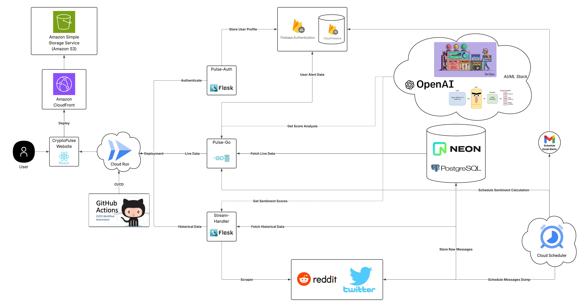

# CryptoPulse

> Your Crypto-Invest Mate 🚀  
> Real-time sentiment aggregation from Reddit, news, and more — all in one place.

---

## 📖 Table of Contents

- [Problem & Solution](#problem--solution)
- [Key Features](#key-features)
- [Architecture & Tech Stack](#architecture--tech-stack)
- [Getting Started](#getting-started)
  - [Prerequisites](#prerequisites)
  - [Installation](#installation)
  - [Running Locally](#running-locally)
- [Demo](#demo)
- [Credits](#credits)

---

## 🚩 Problem & Solution

**Problem:** Crypto markets are notoriously volatile and move faster than any single news source can keep up. Real-time public sentiment lives scattered across Reddit, Twitter, news feeds, Telegram, and Discord — making it hard for retail investors to harness.

**Solution:** CryptoPulse unifies multiple sentiment streams into a single, easy-to-understand score per coin and per topic. We fetch posts & articles, run them through AI models (VADER & BERT), aggregate via a Go microservice, and visualize insights in a sleek React dashboard.

---

## ✨ Key Features

- **Multi-source Stream Handler**  
  - Reddit (primary), News (batch import), Twitter (optional)  
  - Configurable time-window & per-coin filtering  

- **AI-driven Sentiment Models**  
  - Lightweight VADER for speed  
  - BERT fine-tuned for crypto slang  

- **Custom Aggregator Microservice (Go)**  
  - Combines individual scores into a unified sentiment index  
  - Handles spikes, noise-filtering & time-binning  

- **Secure Auth & Data Storage**  
  - Firebase Auth + Firestore for user management  
  - PostgreSQL (Neon) for historical messages  

- **DevOps & Deployment**  
  - Dockerized services  
  - CI/CD via GitHub Actions  
  - Hosted on Google Cloud Run  

---

## 🏗 Architecture & Tech Stack

<p align="center">
  
</p>

| Layer               | Technology                           |
|---------------------|--------------------------------------|
| **Stream Handler**  | Python · Flask · PRAW (Reddit)       |
| **Sentiment Model** | Python · VADER · Transformers (BERT) |
| **Aggregator**      | Go                                   |
| **Auth**            | Firebase Authentication & Firestore  |
| **Dashboard**       | React.js · Recharts                  |
| **Database**        | PostgreSQL (Neon)                    |
| **Containerization**| Docker                               |
| **CI/CD**           | GitHub Actions · Google Cloud Run    |
| **Version Control** | Git · GitHub                         |
| **Issue Tracking**  | Jira                                 |

---

## 🚀 Getting Started

### Prerequisites

- Git  
- Docker & Docker Compose  
- Node.js & npm (for frontend)  
- Python 3.9+  
- Go 1.18+  

### Installation

1. **Clone the repo**  
   ```bash
   git clone https://github.com/vsriharsha814/crypto-sentiment-stream.git
   cd crypto-sentiment-stream
   ```

2. **Backend**
   ```bash
   cd stream-handler
   cp .env.example .env
   # Fill in your REDDIT_CLIENT_ID, REDDIT_CLIENT_SECRET, DB_*, FIREBASE_* vars
   python3 -m venv venv && source venv/bin/activate
   pip install -r requirements.txt
   ```

3. **Frontend**
   ```bash
   cd ../frontend/my-crypto-app
   npm install
   ```

4. **Go Aggregator**
   ```bash
   cd ../../go-service
   go build -o aggregator .
   ```

---

### Running Locally

```bash
# 1. Ensure your Neon/Postgres DB is reachable.
# 2. In separate terminals:

# Backend API
cd stream-handler
source venv/bin/activate
python app.py

# Go Aggregator
cd ../go-service
./aggregator

# Frontend Dashboard
cd ../frontend/my-crypto-app
npm start
```

### 📡 API Reference


   
   
